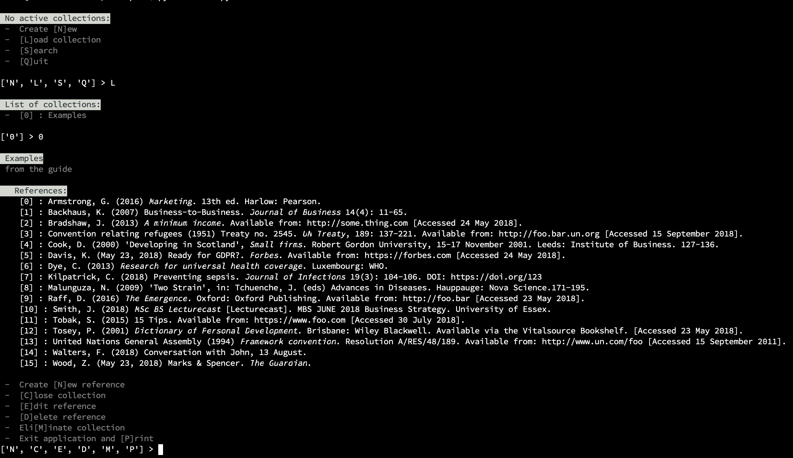

# harvard-referencing 🤓

Harvard References collects and to formats references according to the standard of the University of Essex (Harvard style).



## requirements
<p>
  <a href="https://www.python.org/">
    
  </a>
  <a href="https://pypi.org/project/colorama/">
    
  </a>
</p>

## how to use it

setup with

```pip3 install -e .```

run the tests with

```python3 setup.py test```

start it with

```python3 main.py```

## main repository

https://github.com/ros101/harvard-referencing
